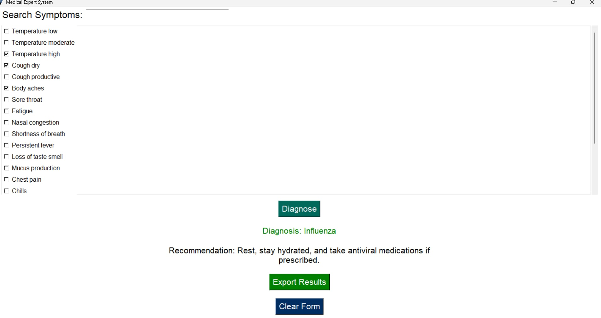

A simple AI-powered medical expert system built with Python and Tkinter to diagnose respiratory conditions based on selected symptoms.

- Intuitive and responsive GUI with animation
- Symptom search and selection
- Real-time diagnosis based on knowledge base
- Export diagnosis and recommendation to PDF or text file
- Clear and professional interface

- Influenza
- COVID-19
- Pneumonia
- Bronchitis
- Asthma
- COPD
- Tuberculosis

The expert system uses a rule-based knowledge base. When a user selects symptoms, the engine matches the input to known rule sets to infer a possible diagnosis.

